# 📊 Data Cleaning với Pandas & Cẩm Nang Trực Quan Hóa Dữ Liệu Toàn Diện (16 Charts Guide)

Dự án này cung cấp một bộ thực hành hoàn chỉnh từ việc **tạo dữ liệu thô có lỗi thực tế (Dirty Data)**, **quy trình làm sạch dữ liệu toàn diện với Pandas (Data Cleaning Pipeline)** cho đến **trực quan hóa với 16 loại biểu đồ chuyên nghiệp** kèm cẩm nang phân tích: **khi nào nên dùng và không nên dùng loại biểu đồ nào**.

---

## 📑 Mục Lục
1. [Cấu Trúc Dự Án](#-cấu-trúc-dự-án)
2. [Cẩm Nang Làm Sạch Dữ Liệu với Pandas](#-cẩm-nang-làm-sạch-dữ-liệu-với-pandas)
3. [Cẩm Nang Trực Quan Hóa: Chi Tiết 16 Loại Biểu Đồ](#-cẩm-nang-trực-quan-hóa-chi-tiết-16-loại-biểu-đồ)
   - [01. Line Chart (Biểu Đồ Đường)](#01-line-chart-biểu-đồ-đường)
   - [02. Bar Chart (Biểu Đồ Cột)](#02-bar-chart-biểu-đồ-cột)
   - [03. Grouped Bar Chart (Biểu Đồ Cột Nhóm)](#03-grouped-bar-chart-biểu-đồ-cột-nhóm)
   - [04. Stacked Bar Chart (Biểu Đồ Cột Chồng)](#04-stacked-bar-chart-biểu-đồ-cột-chồng)
   - [05. Histogram (Biểu Đồ Tần Số)](#05-histogram-biểu-đồ-tần-số)
   - [06. KDE / Density Plot (Biểu Đồ Mật Độ)](#06-kde--density-plot-biểu-đồ-mật-độ)
   - [07. Box Plot (Biểu Đồ Hộp Phát Hiện Ngoại Lai)](#07-box-plot-biểu-đồ-hộp-phát-hiện-ngoại-lai)
   - [08. Violin Plot (Biểu Đồ Vĩ Cầm)](#08-violin-plot-biểu-đồ-vĩ-cầm)
   - [09. Scatter Plot (Biểu Đồ Phân Tán)](#09-scatter-plot-biểu-đồ-phân-tán)
   - [10. Bubble Chart (Biểu Đồ Bong Bóng)](#10-bubble-chart-biểu-đồ-bong-bóng)
   - [11. Heatmap (Bản Đồ Nhiệt Ma Trận Tương Quan)](#11-heatmap-bản-đồ-nhiệt-ma-trận-tương-quan)
   - [12. Donut / Pie Chart (Biểu Đồ Tròn Bánh Donut)](#12-donut--pie-chart-biểu-đồ-tròn-bánh-donut)
   - [13. Treemap (Bản Đồ Cây Phân Cấp)](#13-treemap-bản-đồ-cây-phân-cấp)
   - [14. Stacked Area Chart (Biểu Đồ Miền Chồng)](#14-stacked-area-chart-biểu-đồ-miền-chồng)
   - [15. Radar / Spider Chart (Biểu Đồ Mạng Nhện)](#15-radar--spider-chart-biểu-đồ-mạng-nhện)
   - [16. Pairplot (Ma Trận Đa Biến)](#16-pairplot-ma-trận-đa-biến)
4. [Bảng Tra Cứu Nhanh (Decision Matrix Chọn Biểu Đồ)](#-bảng-tra-cứu-nhanh-decision-matrix)
5. [Hướng Dẫn Cài Đặt & Chạy](#-hướng-dẫn-cài-đặt--chạy)

---

## 🗂️ Cấu Trúc Dự Án

```bash
Chart/
├── data/
│   ├── raw_data.csv          # Dữ liệu thô chứa đầy đủ lỗi thực tế
│   └── cleaned_data.csv      # Dữ liệu sau khi làm sạch hoàn chỉnh
├── charts/                   # 16 hình ảnh biểu đồ độ phân giải cao
│   ├── 01_line_chart.png
│   ├── 02_bar_chart.png
│   ├── ...
│   └── 16_pairplot.png
├── src/
│   ├── clean_data.py          # Pipeline làm sạch dữ liệu với Pandas
│   └── generate_charts.py     # Script vẽ toàn bộ 16 biểu đồ
└── README.md                  # Tài liệu hướng dẫn chi tiết
```

---

## 🧹 Cẩm Nang Làm Sạch Dữ Liệu với Pandas

Dữ liệu thô trong thực tế thường chứa rất nhiều vấn đề phức tạp. Dưới đây là các kỹ thuật xử lý cụ thể đã được cài đặt trong pipeline `src/clean_data.py`:

### 1. Xử lý Trùng Lặp (Duplicates)
- **Exact Duplicates (Trùng hoàn toàn tất cả các cột)**:
  ```python
  df = df.drop_duplicates().reset_index(drop=True)
  ```
- **Subset Duplicates (Trùng khóa chính như `Order_ID` nhưng khác dữ liệu do nhập đè)**:
  ```python
  df = df.drop_duplicates(subset=["Order_ID"], keep="first").reset_index(drop=True)
  ```

### 2. Xử lý Missing Values & Placeholders
- **Nhận diện và thay thế placeholder**: Dữ liệu thường không để rỗng mà dùng `"N/A"`, `"?"`, `"-"`, `"Unknown"`, `"missing"`:
  ```python
  null_placeholders = ["N/A", "Unknown", "?", "-", "missing", "nan", "None", ""]
  df["Category"] = df["Category"].replace(null_placeholders, np.nan)
  ```
- **Imputation thông minh theo logic nghiệp vụ**:
  - Điền `Category` bị thiếu bằng mapping từ `Product_Name`:
    ```python
    df["Category"] = df["Category"].fillna(df["Product_Name"].map(prod_cat_map))
    ```
  - Điền giá trị số bị thiếu (`Unit_Price`) bằng `median` theo từng danh mục:
    ```python
    df["Unit_Price"] = df.groupby("Category")["Unit_Price"].transform(lambda x: x.fillna(x.median()))
    ```

### 3. Chuẩn Hóa Văn Bản & Lỗi Chính Tả (String Cleaning & Regex)
- **Xóa khoảng trắng thừa & đồng nhất viết hoa**:
  ```python
  df["Category"] = df["Category"].astype(str).str.strip().str.title()
  ```
- **Đồng nhất tên gọi từ đồng nghĩa (Synonyms Mapping)**:
  ```python
  region_mapping = {
      "Vn-North": "North", "NORTH": "North",
      "Vn-South": "South", "SOUTH": "South",
      "Intl": "International", "Overseas": "International", "Global": "International"
  }
  df["Region"] = df["Region"].map(region_mapping).fillna(df["Region"].mode()[0])
  ```

### 4. Chuyển Đổi Kiểu Dữ Liệu & Làm Sạch Số Tiền (Type Casting)
- Cột số bị dính ký tự tiền tệ (`$`, `USD`, `,`):
  ```python
  df["Unit_Price"] = df["Unit_Price"].astype(str).str.replace(r"[^\d.]", "", regex=True)
  df["Unit_Price"] = pd.to_numeric(df["Unit_Price"], errors="coerce")
  ```

### 5. Chuẩn Hóa Ngày Tháng Hỗn Hợp (Mixed Datetime Parsing)
- Xử lý cột ngày chứa nhiều format lẫn lộn (`YYYY-MM-DD`, `DD/MM/YYYY`, `Mon DD, YYYY`):
  ```python
  df["Order_Date"] = pd.to_datetime(df["Order_Date"], errors="coerce", format="mixed")
  # Điền các ngày bị lỗi (NaT) bằng median date
  df["Order_Date"] = df["Order_Date"].fillna(df["Order_Date"].dropna().iloc[0])
  ```

### 6. Xử lý Outliers & Giá Trị Bất Thường (Sentinel Values)
- **Giá trị Sentinel (lính canh)**: `Customer_Age` = `-999`, `<= 0` hoặc `> 100`:
  ```python
  median_age = df.loc[(df["Customer_Age"] > 10) & (df["Customer_Age"] < 100), "Customer_Age"].median()
  df.loc[(df["Customer_Age"] <= 0) | (df["Customer_Age"] > 100) | (df["Customer_Age"].isna()), "Customer_Age"] = median_age
  ```
- **Số lượng âm hoặc cực đoan**: `Quantity <= 0` hoặc `Quantity > 50` gán về mặc định.
- **Giới hạn cận (Clipping)**: Đảm bảo Rating nằm trong đoạn $[1.0, 5.0]$.

### 7. Tạo Biến Phân Tích Mới (Feature Engineering)
```python
df["Total_Amount"] = round(df["Unit_Price"] * df["Quantity"], 2)
df["Profit"] = round(df["Total_Amount"] * df["Profit_Margin"], 2)
df["Order_Month"] = df["Order_Date"].dt.strftime("%Y-%m")
df["Age_Group"] = pd.cut(df["Customer_Age"], bins=[0, 25, 35, 50, 100], 
                         labels=["Gen Z (<25)", "Young Adults (25-34)", "Middle-Aged (35-49)", "Seniors (50+)"])
```

---

## 📈 Cẩm Nang Trực Quan Hóa: Chi Tiết 16 Loại Biểu Đồ

---

### 01. Line Chart (Biểu Đồ Đường)

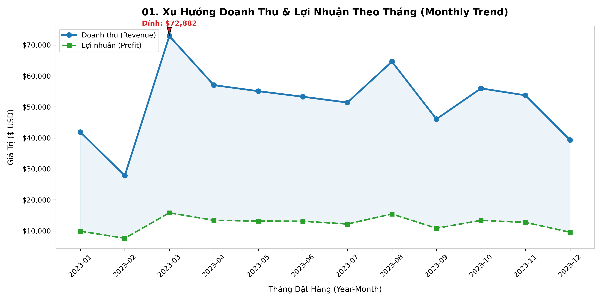

- **Mục đích**: Thể hiện xu hướng biến đổi liên tục của dữ liệu theo thời gian (Time-series).
- **🎯 Khi nào NÊN dùng**:
  - Dữ liệu có tính thứ tự thời gian (ngày, tháng, quý, năm).
  - So sánh tốc độ tăng trưởng/suy giảm giữa 2 - 4 chỉ số (ví dụ: Doanh thu vs Lợi nhuận).
  - Phát hiện tính mùa vụ (seasonality) và chu kỳ kinh doanh.
- **🚫 Khi nào KHÔNG NÊN dùng**:
  - Dữ liệu dạng danh mục rời rạc không có thứ tự thời gian (ví dụ: so sánh các phòng ban).
  - Có quá nhiều đường (trên 5 đường) gây rối mắt ("spaghetti chart").
- **💡 Best Practice**: Tô màu vùng đệm nhẹ (fill between) và đánh dấu điểm cực trị (Đỉnh/Đáy) kèm nhãn chú thích rõ ràng.

---

### 02. Bar Chart (Biểu Đồ Cột)

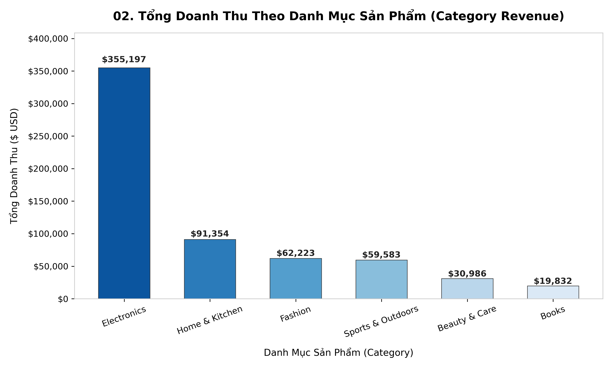

- **Mục đích**: So sánh độ lớn giữa các danh mục rời rạc (Categorical Comparison).
- **🎯 Khi nào NÊN dùng**:
  - So sánh tổng số, trung bình hoặc đếm tần suất giữa các nhóm danh mục.
  - Số lượng danh mục từ 3 đến 12 nhóm.
  - Cần hiển thị giá trị cụ thể trực tiếp trên đầu mỗi cột (Data labels).
- **🚫 Khi nào KHÔNG NÊN dùng**:
  - Trục tung không bắt đầu từ 0 (gây hiểu nhầm về độ chênh lệch thực tế).
  - Có quá nhiều danh mục (> 20) -> nên chuyển sang Horizontal Bar Chart (Cột ngang) hoặc chỉ lấy Top N.
- **💡 Best Practice**: Sắp xếp các cột theo thứ tự tăng dần hoặc giảm dần để người đọc nắm bắt thứ hạng ngay lập tức.

---

### 03. Grouped Bar Chart (Biểu Đồ Cột Nhóm)

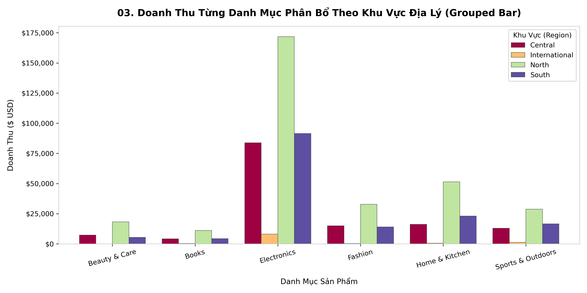

- **Mục đích**: So sánh đa chiều giữa 2 biến phân loại cùng lúc (Sub-category Comparison).
- **🎯 Khi nào NÊN dùng**:
  - So sánh trực tiếp giá trị của các phân nhóm con trong từng nhóm chính (ví dụ: Doanh số từng ngành hàng phân bổ theo từng miền).
  - Cần thấy rõ sự vượt trội tương đối của nhóm con.
- **🚫 Khi nào KHÔNG NÊN dùng**:
  - Khi có quá nhiều biến phân loại lồng nhau tạo ra quá nhiều cột nhỏ san sát nhau.
  - Khi mục tiêu là xem tổng thể đóng góp (100%) hơn là so sánh giá trị tuyệt đối.
- **💡 Best Practice**: Sử dụng bảng màu tương phản rõ rệt và đặt chú giải (Legend) ở vị trí dễ nhìn.

---

### 04. Stacked Bar Chart (Biểu Đồ Cột Chồng)

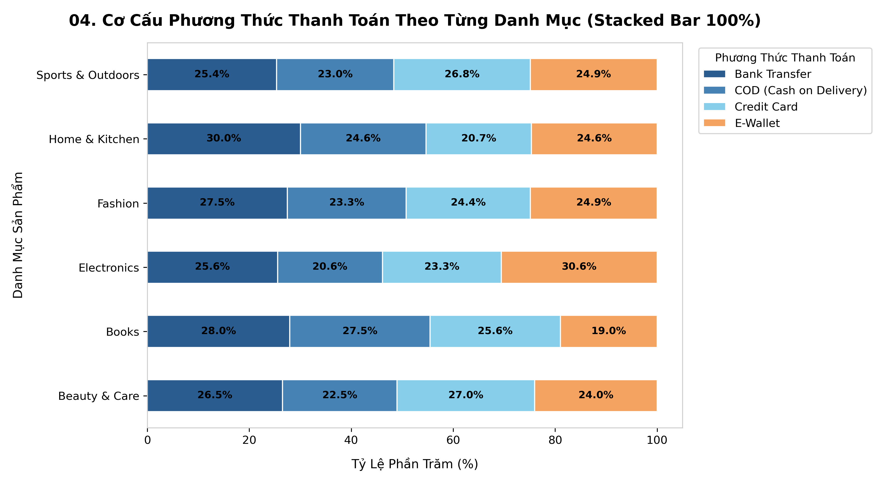

- **Mục đích**: Thể hiện tỷ trọng thành phần đóng góp vào tổng thể của từng nhóm (Part-to-Whole Breakdown).
- **🎯 Khi nào NÊN dùng**:
  - Muốn xem cơ cấu tỷ lệ phần trăm (100% Stacked Bar) hoặc tổng thể và các phần cấu thành.
  - Ví dụ: Tỷ lệ các phương thức thanh toán trong từng ngành hàng.
- **🚫 Khi nào KHÔNG NÊN dùng**:
  - Cần so sánh chính xác các phần tử ở giữa giữa các cột (vì các phần tử ở giữa không có cùng mốc đáy).
  - Có quá nhiều phân nhóm nhỏ lẻ (> 5 phần tử con).
- **💡 Best Practice**: Ghi nhãn phần trăm trực tiếp vào giữa từng đoạn để người xem không phải ước lượng bằng mắt.

---

### 05. Histogram (Biểu Đồ Tần Số)

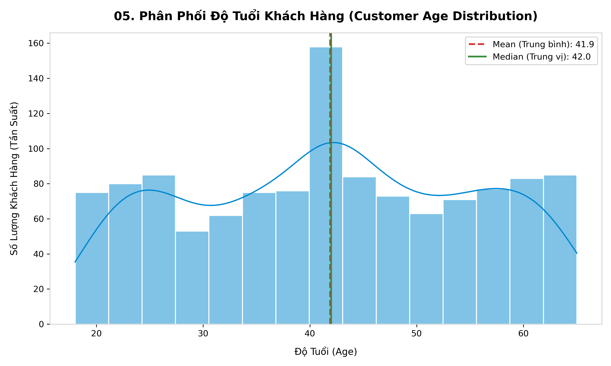

- **Mục đích**: Phân tích phân phối và tần suất xuất hiện của một biến số liên tục (Distribution).
- **🎯 Khi nào NÊN dùng**:
  - Kiểm tra dạng phân phối dữ liệu (Phân phối chuẩn hình chuông, phân phối lệch trái, lệch phải, đa đỉnh).
  - Đánh giá khoảng tập trung dữ liệu (ví dụ: độ tuổi khách hàng tập trung ở khoảng nào nhiều nhất).
- **🚫 Khi nào KHÔNG NÊN dùng**:
  - Dữ liệu dạng danh mục rời rạc (dùng Bar Chart thay thế).
  - Kích thước mẫu quá nhỏ (< 30 bản ghi).
- **💡 Best Practice**: Chọn số lượng khoảng (Bins) phù hợp, kết hợp vẽ đường mật độ KDE và đường trung bình/trung vị (Mean/Median).

---

### 06. KDE / Density Plot (Biểu Đồ Mật Độ)

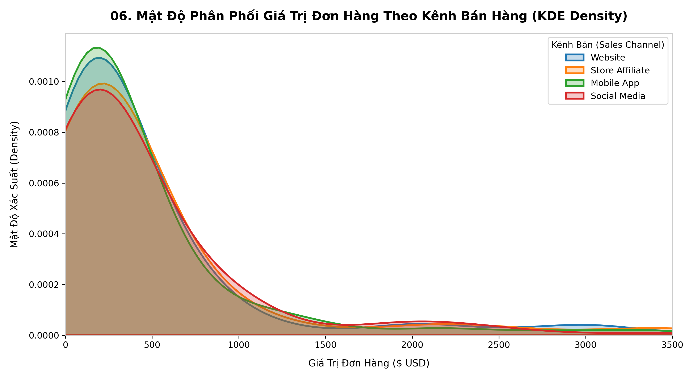

- **Mục đích**: Làm mịn biểu đồ phân phối xác suất liên tục của dữ liệu mà không bị phụ thuộc vào số lượng bin.
- **🎯 Khi nào NÊN dùng**:
  - So sánh hình dạng phân phối giữa nhiều nhóm trên cùng một hệ trục (ví dụ: giá trị đơn hàng theo các kênh bán lẻ).
  - Dữ liệu có kích thước mẫu lớn và cần cái nhìn mượt mà, tổng quan.
- **🚫 Khi nào KHÔNG NÊN dùng**:
  - Dữ liệu có kích thước quá nhỏ, đường cong nội suy có thể tạo ra các giá trị ảo vượt ngoài miền dữ liệu thực.
- **💡 Best Practice**: Đặt độ trong suốt `alpha` từ 0.2 - 0.4 khi tô màu vùng diện tích để tránh che khuất các nhóm khác.

---

### 07. Box Plot (Biểu Đồ Hộp Phát Hiện Ngoại Lai)

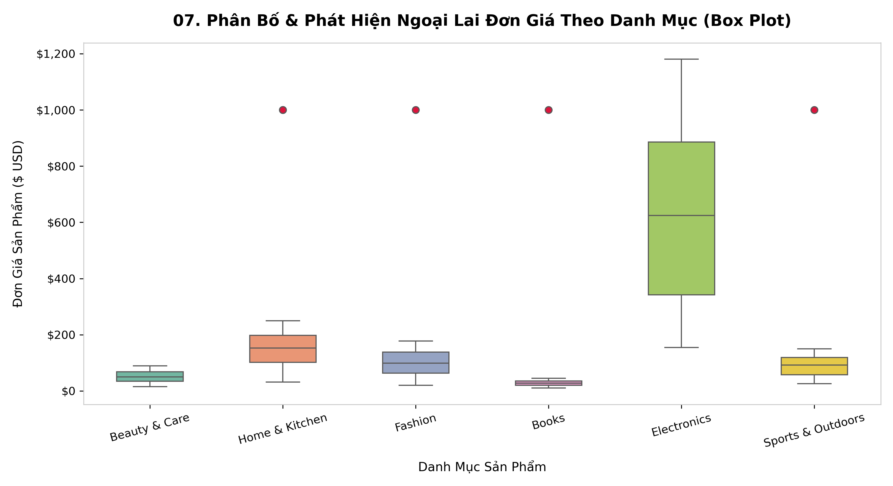

- **Mục đích**: Tóm tắt phân phối dữ liệu dựa trên 5 con số thống kê (Min, Q1, Median, Q3, Max) và phát hiện Outliers.
- **🎯 Khi nào NÊN dùng**:
  - Phát hiện nhanh các giá trị ngoại lai (Outliers nằm ngoài khoảng $1.5 \times IQR$).
  - So sánh độ phân tán và độ lệch (Skewness) giữa nhiều nhóm khác nhau.
- **🚫 Khi nào KHÔNG NÊN dùng**:
  - Đối tượng xem báo cáo là người không có kiến thức cơ bản về thống kê (có thể khó hiểu khái niệm Q1/Q3).
  - Dữ liệu có phân phối đa đỉnh (bimodal/multimodal) vì Box Plot không thể hiện được số lượng đỉnh.
- **💡 Best Practice**: Đánh dấu rõ các điểm Outliers bằng màu nổi bật (ví dụ: đỏ/crimson).

---

### 08. Violin Plot (Biểu Đồ Vĩ Cầm)

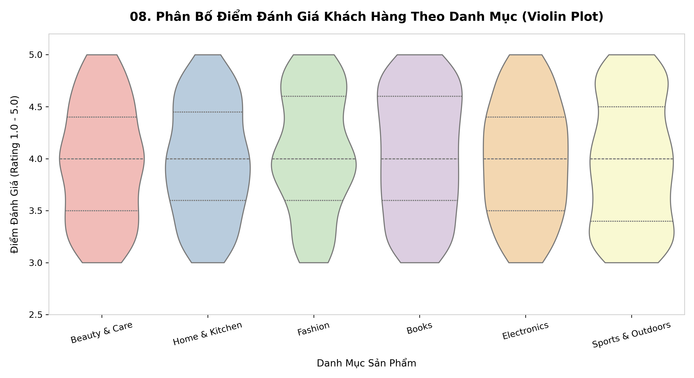

- **Mục đích**: Kết hợp sức mạnh của Box Plot (tứ phân vị) và KDE Plot (mật độ) để mô tả trọn vẹn phân phối.
- **🎯 Khi nào NÊN dùng**:
  - Muốn xem cả vị trí trung vị, tứ phân vị VÀ hình dáng phân phối (đa đỉnh, độ phình to/nhỏ của dữ liệu).
  - So sánh điểm đánh giá khách hàng (Ratings), mức độ hài lòng theo từng nhóm.
- **🚫 Khi nào KHÔNG NÊN dùng**:
  - Kích thước tập dữ liệu quá nhỏ.
  - Báo cáo cho đại chúng cần tính đơn giản tuyệt đối.
- **💡 Best Practice**: Đặt `inner="quartile"` hoặc `inner="box"` bên trong thân vĩ cầm để dễ đối chiếu.

---

### 09. Scatter Plot (Biểu Đồ Phân Tán)

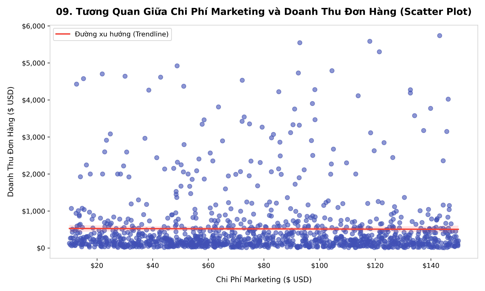

- **Mục đích**: Khám phá mối quan hệ tương quan (Correlation), quy luật liên hệ giữa 2 biến số liên tục.
- **🎯 Khi nào NÊN dùng**:
  - Tìm tương quan thuận/nghịch giữa 2 chỉ số (ví dụ: Ngân sách Marketing và Doanh thu).
  - Kiểm tra xem dữ liệu có dạng tuyến tính (Linear), phi tuyến hay phi tương quan.
  - Phát hiện các điểm dị biệt (Bivariate Outliers).
- **🚫 Khi nào KHÔNG NÊN dùng**:
  - Một trong hai biến là biến định tính/danh mục rời rạc.
  - Dữ liệu có quá nhiều điểm trùng lặp vị trí (overplotting) mà không xử lý độ trong suốt.
- **💡 Best Practice**: Thêm đường hồi quy xu hướng (Trendline / Regression line) để làm nổi bật chiều hướng tương quan.

---

### 10. Bubble Chart (Biểu Đồ Bong Bóng)

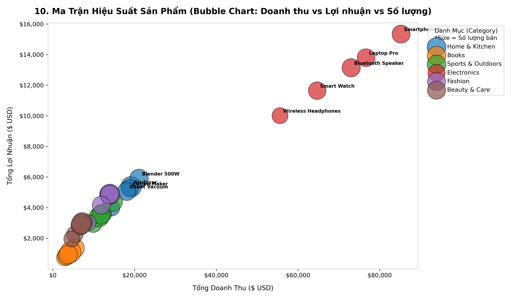

- **Mục đích**: Mở rộng biểu đồ phân tán để phân tích đồng thời 3 đến 4 chiều dữ liệu trên cùng một đồ thị.
- **🎯 Khi nào NÊN dùng**:
  - Cần đánh giá hiệu suất tổng thể của các đối tượng:
    - **Trục X**: Biến định lượng 1 (Doanh thu).
    - **Trục Y**: Biến định lượng 2 (Lợi nhuận).
    - **Kích thước bóng (Size)**: Biến định lượng 3 (Số lượng bán).
    - **Màu sắc (Color)**: Biến phân loại (Ngành hàng/Danh mục).
- **🚫 Khi nào KHÔNG NÊN dùng**:
  - Sự chênh lệch kích thước quá lớn khiến các bóng đè lên nhau hoặc quá nhỏ không nhìn thấy.
- **💡 Best Practice**: Chú thích tên đối tượng trực tiếp lên các bong bóng nổi bật và hiển thị bảng chú giải kích thước.

---

### 11. Heatmap (Bản Đồ Nhiệt Ma Trận Tương Quan)

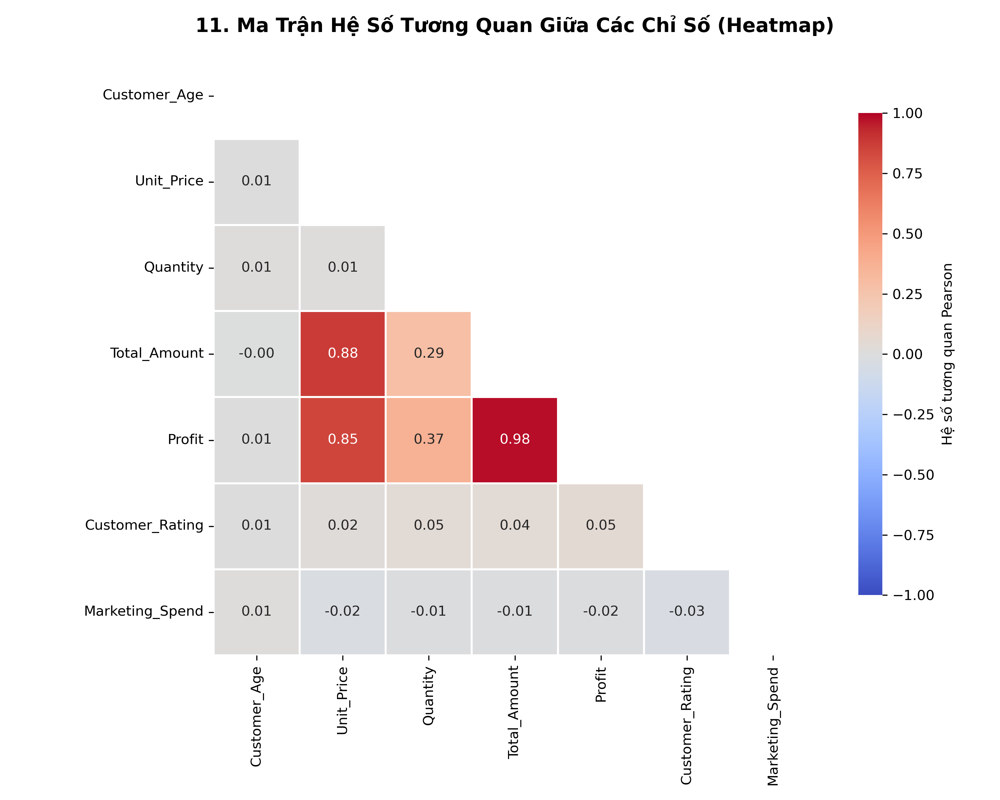

- **Mục đích**: Trực quan hóa ma trận số liệu thông qua cường độ màu sắc (Color intensity).
- **🎯 Khi nào NÊN dùng**:
  - Ma trận hệ số tương quan Pearson giữa tất cả các cặp biến định lượng trong tập dữ liệu.
  - Bảng tần suất chéo (Cross-tabulation) hoặc phân tích hành vi theo giờ trong ngày / ngày trong tuần.
- **🚫 Khi nào KHÔNG NÊN dùng**:
  - Ma trận có kích thước quá lớn mà không lọc bớt biến.
  - Chọn bảng màu không có tính đối xứng (nên dùng bảng màu phân kỳ như `coolwarm` cho ma trận tương quan $-1$ đến $+1$).
- **💡 Best Practice**: Sử dụng tam giác dưới (`mask=np.triu(...)`) để loại bỏ các ô trùng lặp đối xứng qua đường chéo chính.

---

### 12. Donut / Pie Chart (Biểu Đồ Tròn Bánh Donut)

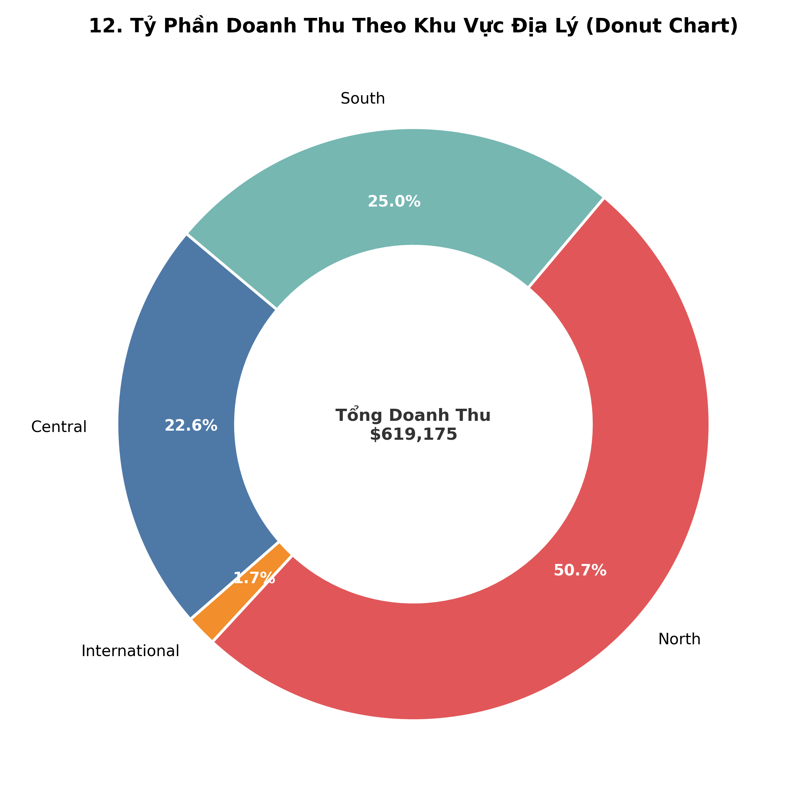

- **Mục đích**: Thể hiện tỷ phần đóng góp của các nhóm nhỏ vào một tổng thể duy nhất (100%).
- **🎯 Khi nào NÊN dùng**:
  - Số lượng danh mục ít (chỉ từ 2 đến 5 phần).
  - Tỷ trọng giữa các phần có sự khác biệt rõ rệt (ví dụ: thị phần khu vực Bắc - Trung - Nam - Quốc tế).
  - Donut Chart ưu việt hơn Pie Chart vì khoảng trống ở giữa có thể ghi tổng giá trị đại diện.
- **🚫 Khi nào KHÔNG NÊN dùng**:
  - Có quá nhiều lát cắt (> 6 lát cắt) làm người xem khó phân biệt diện tích.
  - So sánh các lát cắt có kích thước gần tương đương nhau (mắt người khó so sánh góc hơn là chiều dài thanh cột).
- **💡 Best Practice**: Bắt đầu lát cắt lớn nhất từ vị trí 12 giờ và gắn nhãn phần trăm trực tiếp trên lát cắt.

---

### 13. Treemap (Bản Đồ Cây Phân Cấp)

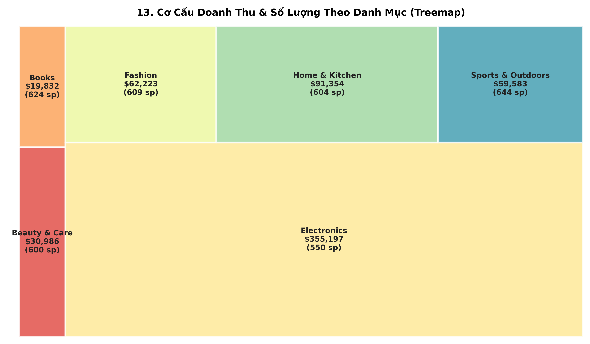

- **Mục đích**: Hiển thị dữ liệu có cấu trúc phân cấp (Hierarchical data) dưới dạng các hình chữ nhật lồng nhau với diện tích tỷ lệ thuận với giá trị.
- **🎯 Khi nào NÊN dùng**:
  - Có nhiều danh mục (từ 6 đến 20 nhóm) mà Pie Chart không thể hiện được.
  - Cần so sánh tỷ trọng đóng góp của các ngành hàng và danh mục phụ.
  - Tận dụng tối đa không gian màn hình hiển thị.
- **🚫 Khi nào KHÔNG NÊN dùng**:
  - Cần so sánh cực kỳ chính xác độ chênh lệch giữa hai nhóm có diện tích gần bằng nhau.
- **💡 Best Practice**: Ghi rõ Tên danh mục, Giá trị tiền và Số lượng trực tiếp trong từng ô chữ nhật.

---

### 14. Stacked Area Chart (Biểu Đồ Miền Chồng)

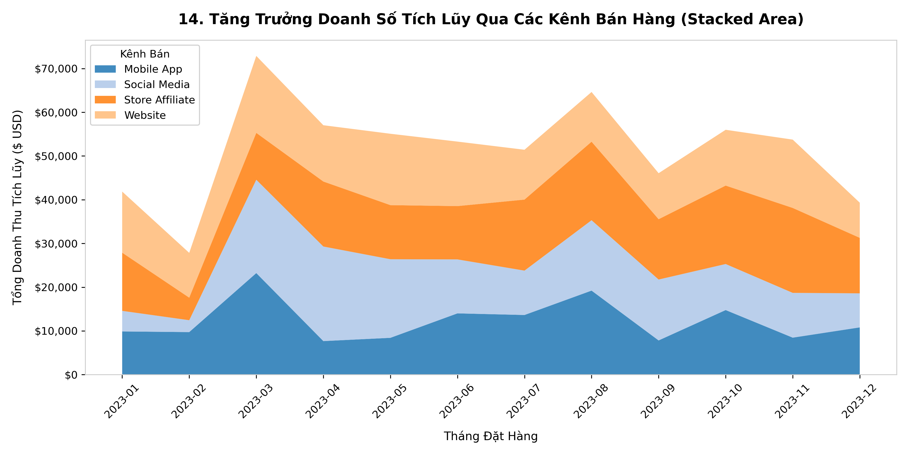

- **Mục đích**: Thể hiện sự thay đổi của tổng giá trị VÀ sự đóng góp của từng bộ phận theo thời gian.
- **🎯 Khi nào NÊN dùng**:
  - Theo dõi sự tăng trưởng doanh số tích lũy qua các kênh bán lẻ theo từng tháng.
  - Cần thấy rõ cả quy mô thị trường mở rộng và tỷ lệ chiếm lĩnh của từng kênh.
- **🚫 Khi nào KHÔNG NÊN dùng**:
  - Dữ liệu có nhiều biến động lên xuống quá mạnh gây méo mó các dải màu ở trên.
  - Khi mục tiêu là theo dõi chính xác từng đường riêng lẻ (dùng Line Chart tốt hơn).
- **💡 Best Practice**: Đặt nhóm ổn định nhất hoặc lớn nhất ở dưới cùng để làm mốc nền vững chắc.

---

### 15. Radar / Spider Chart (Biểu Đồ Mạng Nhện)

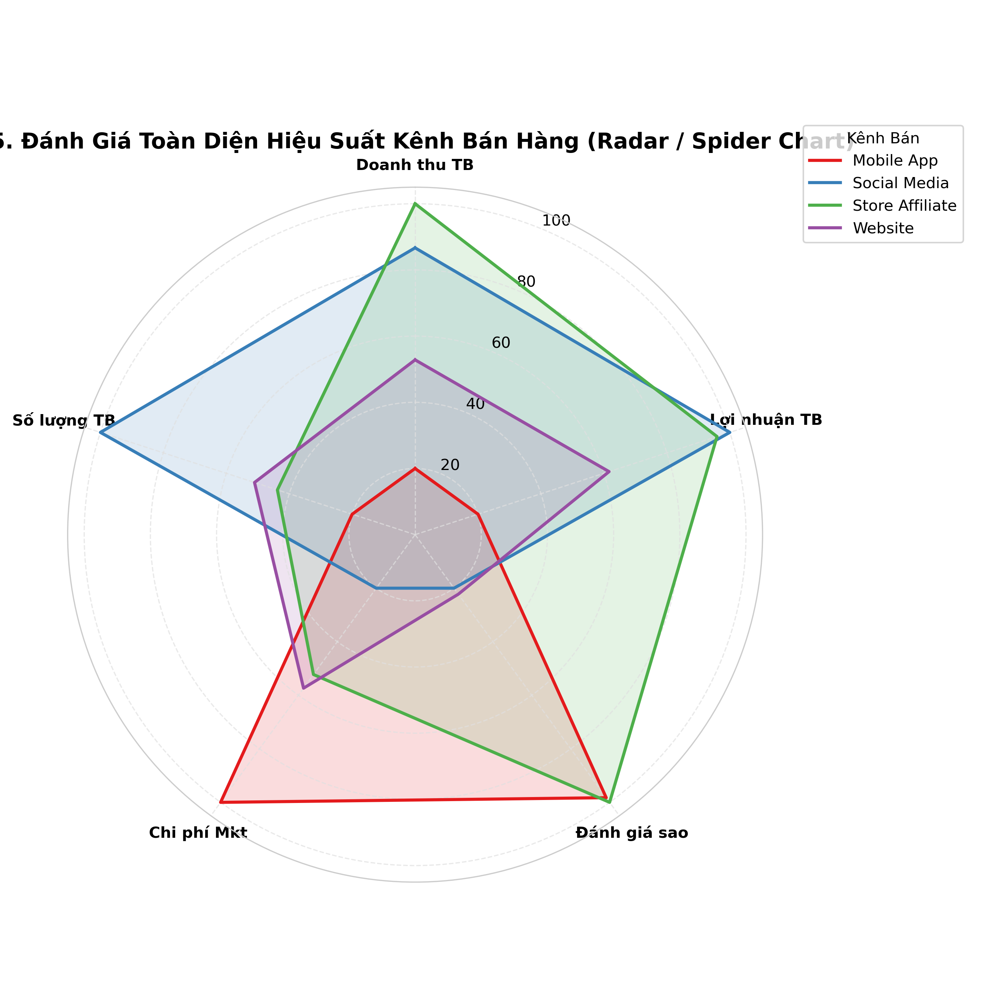

- **Mục đích**: Đánh giá và so sánh hiệu suất toàn diện của các đối tượng trên nhiều tiêu chí định lượng khác nhau.
- **🎯 Khi nào NÊN dùng**:
  - Đánh giá hồ sơ năng lực (Profile), hiệu suất kênh bán hàng trên 5-7 chỉ số (Doanh thu, Lợi nhuận, Đánh giá, Chi phí, Khối lượng).
  - Nhìn thấy ngay điểm mạnh/điểm yếu vượt trội của từng kênh.
- **🚫 Khi nào KHÔNG NÊN dùng**:
  - So sánh quá nhiều đối tượng (> 4 đối tượng) khiến các đa giác màu đè lấp lên nhau.
  - Các biến chưa được chuẩn hóa về cùng một thang đo (ví dụ: $0 - 100$).
- **💡 Best Practice**: Luôn chuẩn hóa Min-Max các chỉ số về cùng thang điểm trước khi vẽ.

---

### 16. Pairplot (Ma Trận Biểu Đồ Cặp)

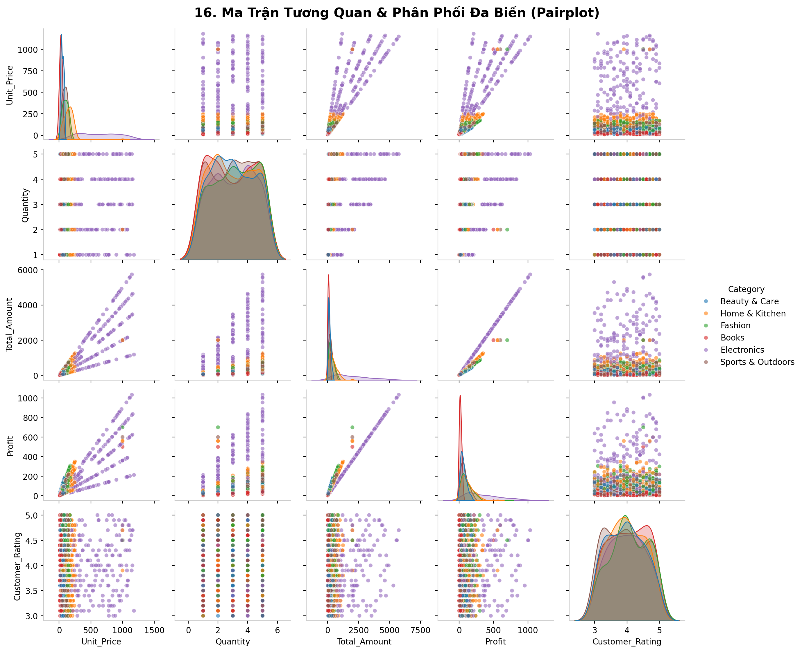

- **Mục đích**: Cung cấp bức tranh toàn cảnh khám phá dữ liệu (Exploratory Data Analysis - EDA) trên tất cả các cặp biến định lượng kết hợp phân nhóm định tính.
- **🎯 Khi nào NÊN dùng**:
  - Giai đoạn đầu của dự án phân tích / Machine Learning để hiểu rõ phân phối đơn biến (trên đường chéo) và tương quan giữa từng cặp biến (ngoài đường chéo).
  - Phân tách theo nhãn phân loại (`hue="Category"`) để xem khả năng phân cụm dữ liệu.
- **🚫 Khi nào KHÔNG NÊN dùng**:
  - Báo cáo trình bày cho cấp quản lý cấp cao (vì quá nhiều thông tin chi tiết kỹ thuật).
  - Tập dữ liệu có quá nhiều cột số (> 8 cột) sẽ tạo ma trận khổng lồ và rất chậm.
- **💡 Best Practice**: Chỉ chọn ra 4 - 6 biến quan trọng nhất để ma trận gọn gàng, sắc nét.

---

## 🧭 Bảng Tra Cứu Nhanh (Decision Matrix)

| Mục Tiêu Phân Tích | Loại Dữ Liệu | Biểu Đồ Khuyến Nghị |
|---|---|---|
| **Xu hướng theo thời gian (Trend)** | 1-4 biến số liên tục theo thời gian | `Line Chart` |
| **So sánh giữa các danh mục (Comparison)** | 1 biến định lượng, 1 biến định tính | `Bar Chart / Column Chart` |
| **So sánh 2 tầng danh mục** | 1 biến định lượng, 2 biến định tính | `Grouped Bar Chart` |
| **Cơ cấu thành phần theo nhóm** | Tỷ trọng các phần con trong từng nhóm | `Stacked Bar Chart` (100%) |
| **Hình dạng phân phối (Distribution)** | 1 biến số liên tục | `Histogram` / `KDE Plot` |
| **Phát hiện Outliers & Tứ phân vị** | 1 biến số liên tục qua các nhóm | `Box Plot` |
| **Phân phối chi tiết & Mật độ** | 1 biến số liên tục qua các nhóm | `Violin Plot` |
| **Mối tương quan giữa 2 biến (Relationship)** | 2 biến số liên tục | `Scatter Plot` (kèm Regression line) |
| **Mối tương quan đa biến 3-4 chiều** | 3 biến định lượng + 1 biến định tính | `Bubble Chart` |
| **Toàn bộ hệ số tương quan** | Ma trận các biến định lượng | `Heatmap Correlation` |
| **Tỷ phần thị phần đơn giản (2-5 phần)** | 1 tổng thể chia thành các phần | `Donut Chart` |
| **Cơ cấu phân cấp đa danh mục** | Dữ liệu cấu trúc cây nhiều tầng | `Treemap` |
| **Tăng trưởng tích lũy theo thời gian** | Nhiều chuỗi thời gian cộng dồn | `Stacked Area Chart` |
| **Đánh giá năng lực đa tiêu chí** | 5-7 chỉ số đánh giá của 2-4 đối tượng | `Radar / Spider Chart` |
| **Khám phá toàn diện đa biến (EDA)** | Tổng thể tập dữ liệu định lượng | `Pairplot` |

---

## 💻 Hướng Dẫn Cài Đặt & Chạy

### 1. Cài đặt môi trường
Đảm bảo bạn đã cài đặt Python (>= 3.9) và các thư viện cần thiết:
```bash
pip install pandas numpy matplotlib seaborn squarify
```

### 2. Chạy toàn bộ quy trình
```bash
# Bước 1: Chạy pipeline làm sạch dữ liệu từ data/raw_data.csv
python src/clean_data.py

# Bước 2: Tự động vẽ và xuất toàn bộ 16 biểu đồ
python src/generate_charts.py
```

---
*Tác giả: Dự án Chuẩn Hóa Dữ Liệu & Data Visualization Master Guide.*